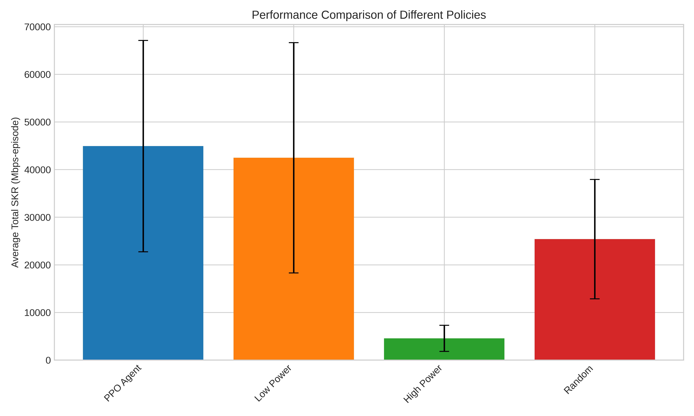
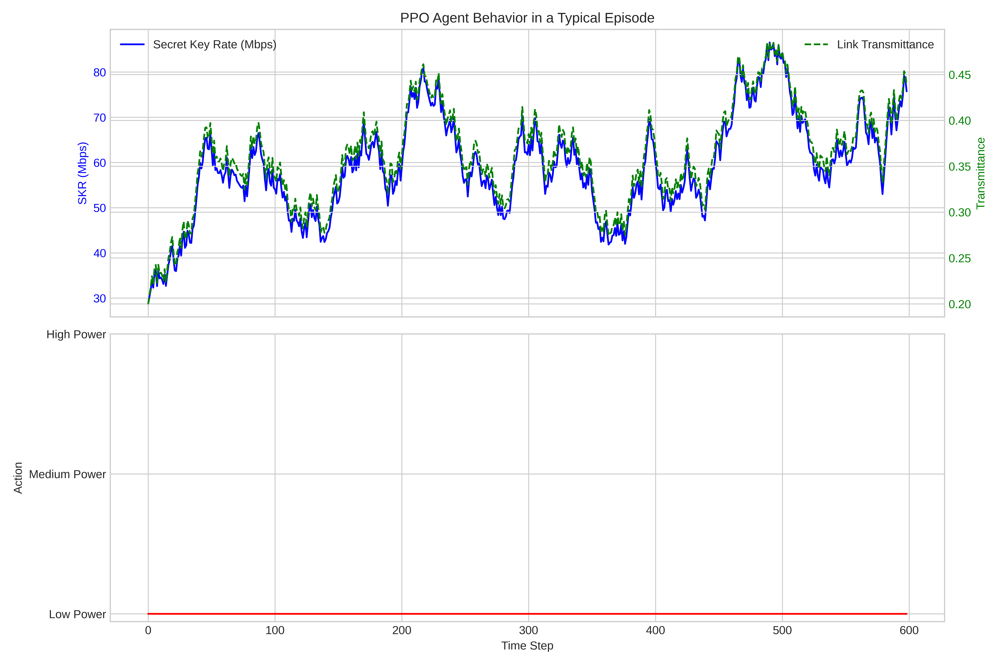

# AI-Enhanced Satellite Quantum Communications: A Reinforcement Learning Approach for Link Optimization

This repository contains the source code and experimental results for the case study section of the research paper:

**"From Theory to Reality: An Architectural Survey of AI's Role in Overcoming Challenges in Satellite Quantum Networks"**

**Author:**
*   Phuc Hao Do ([ORCID: 0000-0003-0645-0021](https://orcid.org/0000-0003-0645-0021))
    *   The Bonch-Bruevich Saint Petersburg State University of Telecommunications, Saint Petersburg, Russia
    *   Danang Architecture University, Da Nang, Vietnam

**Target Journal:**
*   [Quantum Science and Technology](https://iopscience.iop.org/journal/2058-9565) (IOP Publishing, Q1 Journal)

---

## 1. Overview

Satellite Quantum Communication (SQC) promises to build a global, unconditionally secure communication network. However, its practical implementation faces significant hurdles, primarily the volatility and unpredictability of the free-space optical (FSO) channel due to factors like atmospheric turbulence. Static, pre-configured transmission parameters are often sub-optimal, failing to adapt to the dynamic channel conditions.

This project investigates the application of Artificial Intelligence, specifically **Deep Reinforcement Learning (RL)**, to address this challenge. We developed a simulated SQC link environment and trained an RL agent to dynamically select transmission parameters (e.g., power, repetition rate) to maximize the total Secret Key Rate (SKR) during a satellite pass.

This work serves as the practical case study for our comprehensive survey paper, demonstrating a tangible application of AI in overcoming a critical barrier in SQC systems.

## 2. Case Study Results

Our experiments demonstrate that the trained Reinforcement Learning agent (using the PPO algorithm) successfully learns an adaptive policy that outperforms static baseline strategies.

### 2.1. Performance Comparison

The RL agent was benchmarked against three baseline policies over 50 simulated satellite passes. The results clearly indicate the superiority of the adaptive approach.

**Summary of Results:**
| Policy          | Mean Total SKR (Mbps-episode) | Standard Deviation |
|-----------------|:-----------------------------:|:------------------:|
| **PPO Agent**   | **44,918.56**                 | 22,177.91          |
| Low Power       | 42,472.04                     | 24,176.31          |
| High Power      | 4,565.52                      | 2,736.24           |
| Random          | 25,388.92                     | 12,527.33          |


*Figure 1: Comparison of the average total Secret Key Rate achieved per episode by the PPO agent and three baseline policies. The PPO agent demonstrates the highest performance, highlighting the benefits of an adaptive strategy.*

### 2.2. Agent's Adaptive Behavior Analysis

To understand *why* the PPO agent performs better, we analyzed its behavior during a typical episode. The agent intelligently adapts its actions in response to changing channel conditions (represented by link transmittance).


*Figure 2: Analysis of the PPO agent's behavior. The top panel shows the generated Secret Key Rate (blue) and the fluctuating link transmittance (green). The bottom panel shows the corresponding action chosen by the agent. The agent strategically switches to a high-power mode (Action 2) when the channel quality degrades (transmittance drops), a sophisticated behavior that static policies cannot replicate.*

---

## 3. Project Structure

```
.
├── figures/                # Contains generated plots and figures for the paper
│   ├── policy_comparison_bar.png
│   └── ppo_agent_behavior.png
├── src/                    # Contains all source code
│   ├── environment.py      # Defines the custom Gymnasium SQC Link environment
│   ├── train.py            # Script to train the PPO agent
│   └── evaluate.py         # Script to evaluate the trained agent and baselines
├── models/                 # Stores the trained model files (created by train.py)
│   ├── best_model.zip
│   └── ppo_sqc_link_model.zip
├── logs/                   # Stores TensorBoard training logs (created by train.py)
├── .gitignore
├── environment.yml         # Conda environment definition for reproducibility
└── README.md               # This file
```

## 4. How to Reproduce the Results

### 4.1. Prerequisites
*   An NVIDIA GPU with CUDA drivers installed.
*   [Anaconda](https://www.anaconda.com/products/distribution) or [Miniconda](https://docs.conda.io/en/latest/miniconda.html) installed.

### 4.2. Setup
1.  **Clone the repository:**
    ```bash
    git clone https://github.com/ailabteam/ai-sqc-survey.git
    cd ai-sqc-survey
    ```

2.  **Create and activate the Conda environment:**
    The `environment.yml` file specifies all necessary packages.
    ```bash
    conda env create -f environment.yml
    conda activate sqc_rl
    ```

### 4.3. Running the Scripts
All scripts should be run from the root directory of the project.

1.  **Train the model:**
    This script will train the PPO agent for 200,000 timesteps and save the best model in the `src/models/` directory.
    ```bash
    python src/train.py
    ```
    You can monitor the training progress using TensorBoard:
    ```bash
    tensorboard --logdir src/logs/
    ```

2.  **Evaluate the model and generate figures:**
    This script will load the best-trained model, run evaluations against baseline policies, and generate the result plots in the `figures/` directory.
    ```bash
    python src/evaluate.py
    ```
